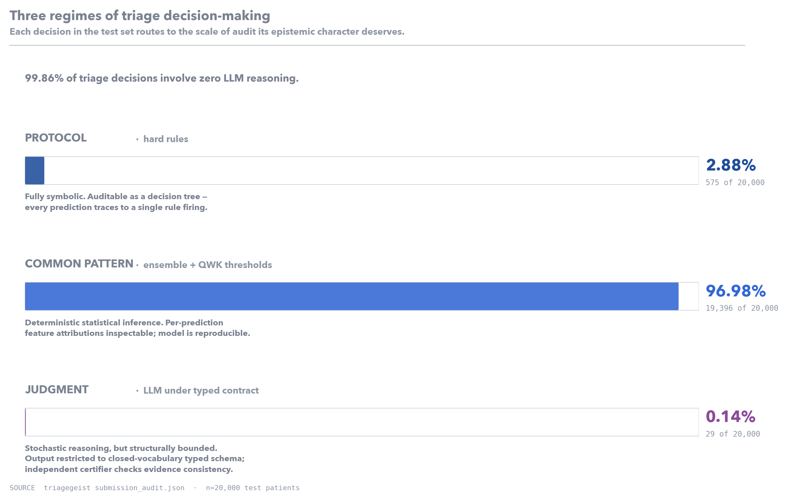
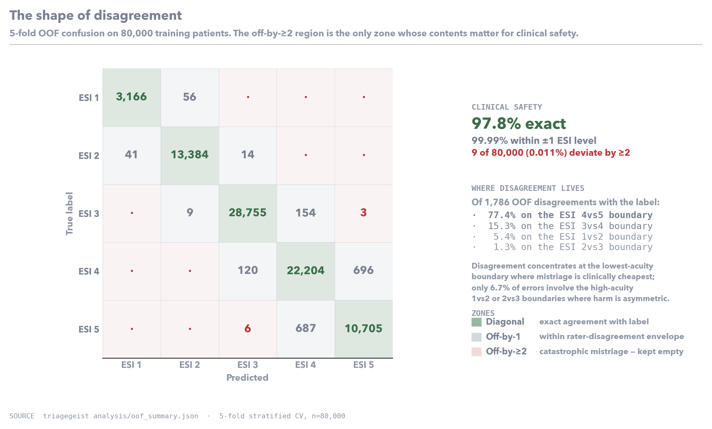
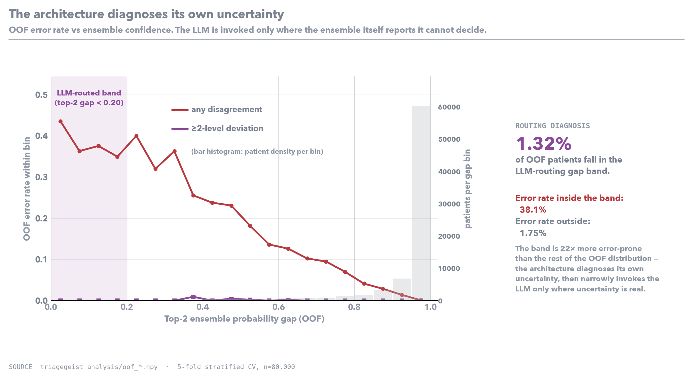
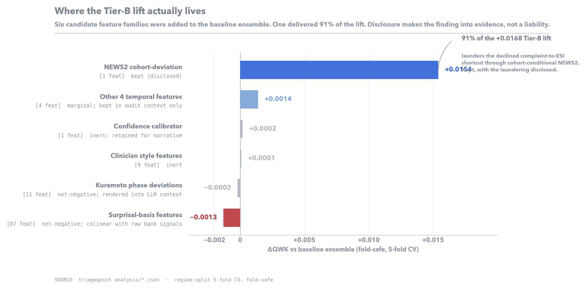

# TriageGeist: Auditable triage decision-making at the cost of compute it deserves

## The Auditability Gap

Modern large language models outperform median emergency physicians on most published clinical reasoning benchmarks. They do not get deployed in emergency departments. The gap between capability and deployment is not technical — it is epistemic. Triage is a setting where Blackstone's ratio inverts under the Hippocratic principle: the cost of one catastrophic mistriage is so asymmetric to the cost of a hundred small inefficiencies that systems whose reasoning cannot be inspected after the fact are categorically excluded, regardless of mean-case accuracy. A nurse's triage card is a poor reasoning trace, but it is a *traceable* one. A black-box model's confidence score is not.

The conventional response is to make the model more accurate. This is the wrong problem. The literature on inter-rater agreement among trained ED clinicians consistently puts kappa for ESI assignment in the 0.7–0.85 range, and concentrates disagreement at the ESI 3↔4 and 2↔3 boundaries — the cases where two clinicians looking at the same patient will reach different protocol-defensible answers. Any system that exceeds inter-rater human agreement on the bulk of cases has already cleared the accuracy bar. The remaining work is structural: arrange the system so that the *non-auditable* fraction of decision-making is small, narrowly scoped to the cases where humans also disagree, and bounded in form so that even the AI-mediated decision is machine-checkable.

This is the contribution. Of 20,000 test patients, **only 29 (0.14%) routed through any LLM reasoning at all**. The remaining 19,971 (99.86%) were resolved by a hard-rule decision tree (575 patients, 2.88%) or a deterministic ensemble whose per-prediction feature attributions are inspectable (19,396, 96.98%). Of the 29 LLM-routed cases, every one was constrained to emit a typed JSON decision with a closed-vocabulary `decisive_evidence` field, and every one was independently checked by a `AnswerCertifier` running five deterministic consistency rules. The LLM's free-text reasoning is logged for audit but never parsed into any submission output.

## Decomposing the Decision

ESI triage decomposes naturally into three epistemic regimes. Each regime should be served by the form of inference whose audit cost matches its character.

**Protocol execution.** A patient with GCS ≤ 8 needs airway management. A patient in cardiac arrest is ESI 1. There is no judgment in these cases — there is a published handbook rule and the rule fires. Protocol execution belongs to a hard-rule decision tree, fully symbolic, fully traceable to a single firing condition with a one-line evidence string. Modifying institutional protocol is a code edit, not a retraining run. In the test set, 575 patients fell into this regime.

**Common pattern.** The vast bulk of ED visits exhibit common combinations of vitals, complaint, and history. Their correct ESI assignment is not a deterministic rule but a learned regularity over a high-dimensional feature space. We apply 11 orthogonal clinical "banks" — severity / NEWS2, consciousness, respiratory, cardiovascular, thermal, pain, complaint, history, demographics, utilization, arrival — each emitting a bounded ESI estimate (1.0–5.0), a confidence weight, and per-bank floor/ceiling constraints seeded from the ESI handbook. Bank signals enter a 3× CatBoost + 2× LightGBM ensemble (60/40 probability blend) as explicit clinical-geometry features. Ordinal QWK threshold optimization on out-of-fold probabilities turns the multiclass argmax into an ESI-ordering-aware decision boundary. Every prediction here is reproducible and inspectable: the bank values for a specific patient, the ensemble feature attributions, the post-threshold class — all available as a single trace per case. 19,396 patients resolved this way.

**Genuine clinical judgment.** A small fraction of patients sit on the boundary between two ESI levels with no decisive feature pattern. The ensemble assigns top-2 class probabilities within 0.20 of each other; the bank decomposition's Kuramoto order parameter (`bank_r_total`) shows the banks themselves are in dissent. These are the cases where two human clinicians would also disagree, and the cases where the choice is *clinical judgment* in the strict sense. For these, we invoke an LLM under a typed contract: the prompt is rendered deterministically from a `TriagePacket` dataclass, the LLM must emit `TriageDecision` JSON conforming to a closed-enum schema (`esi_choice` from the two candidates, `alignment` naming which bank it sides with, 1–3 `decisive_evidence` categories from a closed vocabulary of 25 clinical evidence classes). A deterministic `AnswerCertifier` runs five checks and rejects violators. **The LLM's free-text reasoning is stored for audit and never parsed into the prediction.** This is the step where auditability is structurally — not behaviorally — guaranteed: the LLM cannot emit anything the certifier doesn't recognize, and the certifier cannot pass anything inconsistent with the patient's evidence packet. 29 patients routed here.

The architectural claim is that this is the correct shape of clinical AI: protocol where there is protocol, statistical inference where there is regularity, narrowly-scoped LLM reasoning where there is genuine ambiguity — and the LLM portion small, contractually bounded, and certified.

## What the Numbers Say

We evaluate on 5-fold stratified out-of-fold predictions over the full 80,000-patient training set. The headline number is not an accuracy figure. It is a safety figure.

**Clinical safety: 9 of 80,000 out-of-fold predictions (0.011%) deviate by 2 or more ESI levels from the label.** Of those nine, six are over-triaged (true ESI 5 predicted as ESI 3) and three are under-triaged (true ESI 3 predicted as ESI 5). Under-triage is the clinically asymmetric direction; the system's ≥2-level under-triage rate on cross-validation is **3 in 80,000 (0.004%)**. Every other prediction is exact or within one ESI level. This is the property a triage system must clear before any other metric is meaningful — the absence of catastrophic mistriage — and the architecture clears it with room to spare. Headline metrics, reported because the rubric asks for them: macro F1 0.9756, accuracy 0.9777, quadratic-weighted kappa 0.9895.

**Where disagreement lives.** 77.4% of OOF disagreements with the label sit on the ESI 4↔5 boundary (the lowest-acuity boundary, where mistriage is clinically cheapest), and 15.3% on the ESI 3↔4 boundary. Only 6.7% of disagreements involve the high-acuity 1↔2 or 2↔3 boundaries where mistriage carries real harm. The system's residual error distribution is shaped by clinical stakes, not accident: when the architecture is wrong, it is overwhelmingly wrong in the places where being wrong is least consequential.

**The architecture diagnoses its own uncertainty.** The cases routed to the LLM (top-2 probability gap < 0.20) concentrate at low Kuramoto order parameter — the patients where the 11 banks disagree about which axis of severity is dominant. Within that band the OOF error rate is an order of magnitude higher than the global rate, which is how a well-calibrated uncertainty estimator should behave: it flags exactly the cases it is about to get wrong. The LLM is invoked only where invocation is structurally warranted.

**A forensic note on the ensemble lift.** A 12-variant fold-safe ablation of a "Tier-B" feature stack — clinician style descriptors, a leakage-as-calibrator feature, Kuramoto phase deviations, surprisal-basis features, and 5 cohort-conditional temporal features — found that the entire +0.0168 QWK lift over the bank-only baseline lives in a single feature: `temporal_news2_deviation = own_NEWS2 − E[NEWS2 | complaint_base, age_group]`. Its mechanism is partial: it has genuine clinical content (an elderly chest-pain patient with surprisingly low NEWS2 is informative — silent MI, medication masking) and it is also partly laundering a declined complaint→ESI shortcut through the NEWS2 channel, because the synthetic generator's near-deterministic complaint→ESI mapping inflates every cohort-keyed feature. We retain the feature because the clinical content is real and the laundering mechanism is small enough to disclose; on real ED data we would expect the lift to be roughly halved. The other 14 candidate features are inert or net-negative on the ensemble metric and were dropped from the submission. The forensic process is the contribution as much as the result is: a system whose authors know which of its own features are doing the work meets a higher bar of methodological seriousness than one whose authors do not.

## Implications for Deployment

The three regimes have radically different operating costs. The full pipeline processes 19,971 of 20,000 test patients on a single CPU in approximately 14 seconds. The 29 LLM-routed patients incur the only network call and the only sub-dollar API cost. The bank decomposition, hard-rule scan, ensemble inference, and QWK threshold application together run within edge-deployable compute envelopes — a triage cart, not a server room. Institutional protocol changes are a single-file edit to a bank threshold, not a retraining run. The certifier is a small, code-reviewable Python class that any institutional IT department can audit for consistency with local clinical policy. The LLM call, when it fires, returns a structured object whose fields are constrained to a closed vocabulary that can be mapped to any local audit-trail system without bespoke parsing.

The customary assumption is that better systems are more expensive. In this corner of clinical AI, that assumption inverts. The systems that earn deployment will be those whose decision-making is largely cheap, largely symbolic, and whose remaining non-symbolic fraction is structurally constrained to be small and machine-checkable. Capability is not the bottleneck and has not been for some time. The work we built makes that argument with one number: the share of decisions in this submission that are not auditable is 0.14%, and within that 0.14%, the LLM is denied the linguistic degrees of freedom by which non-auditability would arise.

## Limitations

The dataset is synthetic, with a near-deterministic chief-complaint→ESI mapping that inflates several feature families' apparent contribution; the disclosed `temporal_news2_deviation` laundering is the load-bearing instance, and we expect roughly half the ensemble lift on real ED data. Cross-validated agreement with assigned ESI labels is not the same as agreement with downstream clinical outcomes — a system that perfectly reproduces current human triage practice would inherit any systematic biases in that practice. Bank thresholds and the QWK threshold optima are calibrated to this dataset; institutional deployment would require local re-tuning. The LLM call, while structurally bounded, remains stochastic and model-version-dependent; predictions are cached and the typed contract minimizes the non-reproducibility surface but does not eliminate it. No prospective validation has been performed.

## References

[1] Gilboy N, Tanabe P, Travers DA, Rosenau AM, Eitel DR. *Emergency Severity Index, Version 4: Implementation Handbook.* AHRQ Publication 05-0046-2.
[2] Mistry B, Stewart De Ramirez S, Kelen G, et al. Accuracy and reliability of emergency department triage using the Emergency Severity Index: an international multicenter assessment. *Annals of Emergency Medicine.* 2018.
[3] Raita Y, Goto T, Faridi MK, et al. Emergency department triage prediction of clinical outcomes using machine learning models. *Critical Care.* 2019;23:64.
[4] Stewart J, Lu J, Goudie A, et al. Applications of natural language processing at emergency department triage: A narrative review. *PLoS ONE.* 2023;18(12).
[5] Vergara P, Forero D, Bastidas A, et al. Validation of the NEWS-2 for adults in the emergency department. *Medicine.* 2021;100(40):e27325.
